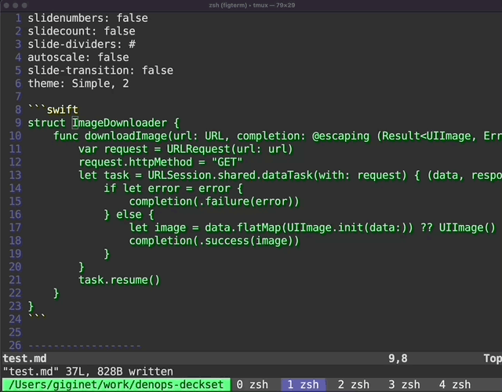
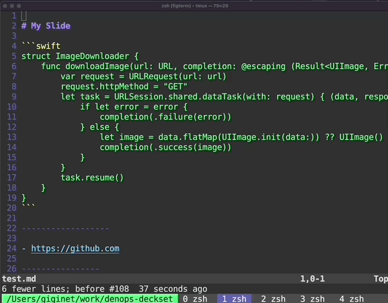
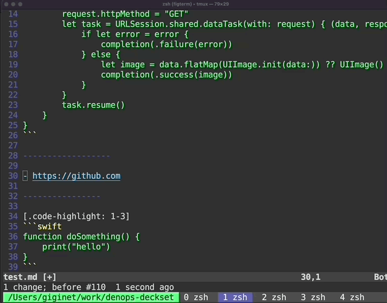

# denops-deckset.vim

[](https://github.com/giginet/denops-deckset.vim/actions/workflows/test.yml)

Vim/Neovim plugin which enpowers editing [Deckset](https://www.deckset.com/) slides.

## Features

### Insert code highlight annotations



Deckset supports [Code highligiting feature](https://docs.decksetapp.com/English.lproj/Formatting/06-code-blocks.html) for Fenced Code Blocks. 
However, writing annotations by hand is very tough.

This plugin supports to insert these annotations easily.

Execute `:InsertCodeHighlight` then it inserts annotations for selecting lines.

### Insert slide configurations



Deckset supports [Configuration commands](https://docs.decksetapp.com/English.lproj/Customization/01-configuration-commands.html).
This plugin helps to insert them easily.

Execute `:InsertConfiguration` then it inserts slide configurations.

You can set your favorite slide configurations before. See [Configuration](#configuration) for details.

### Convert URLs to links



You can wrap URL texts with links.

Execute `:InsertLink` then it converts URLs into links for selecting lines.

## Installation

### Setup vim-denops

denops-deckset powered by [denops.vim](https://github.com/vim-denops/denops.vim).

So you have to prepare denops environment before install.

See [Denops documentation](https://vim-denops.github.io/denops-documentation/tutorial/preparing-deno-and-denops.html) for details.

### Install denops-deckset

#### dein.vim

```toml
[[plugins]]
repo = 'vim-denops/denops.vim'

[[plugins]]
repo = 'giginet/denops-deckset.vim'
depends = ['denops.vim']
```

#### vim-plug

```vim
Plug 'vim-denops/denops.vim'
Plug 'giginet/denops-deckset.vim'
```

Of-course, you can use any other package managers.

## Configuration

### Default slide configurations

You can set your favorite settings on your `.vimrc` for `:InsertConfiguration` command.

See [an official documentation](https://docs.decksetapp.com/English.lproj/Customization/01-configuration-commands.html) for details.

```vim
" Whether slides show current slide numbers. (Default: 0)
let g:deckset#show_slide_numbers=1

" Whether slides show all slide count. (Default: 0)
let g:deckset#show_slide_count=1

" Character for slide dividers. (Default: "#")
let g:deckset#slide_dividers="#"

" Whether slides should scale automatically (Default: 0)
let g:deckset#autoscale=1

" Duration (seconds) for slide transitions. if you set 0, slides don't have transitions. (Default: 0)
let g:deckset#slide_transition=0.3

" Text on footers of each slides. (Default: "")
let g:deckset#footer="(c) My Company all rights reserved."

" Deckset theme and colors
let g:deckset#theme="Simple, 2"
```

### Recommended settings

#### Insert configurations automatically

If you make new slide files. Editors insert configurations automatically as templates.

```vim
au BufNewFile /*/slides/*.md InsertConfiguration<CR>
```

Editors decides documents are regular Markdowns or not based on file locations. You can set your owns.

#### Map keyboard shortcuts of commands

```vim
noremap <C-s>_ :InsertCodeHighlight<CR>
```
